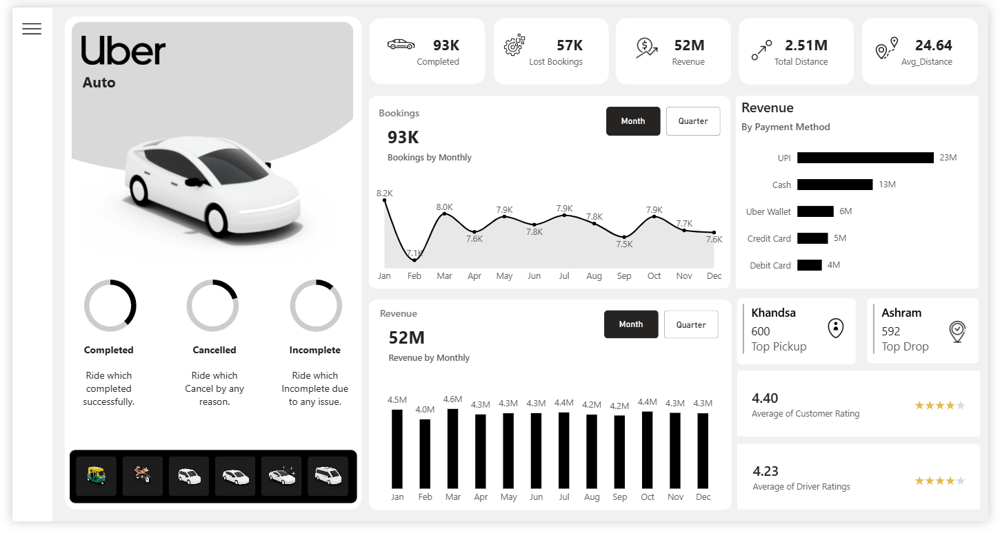
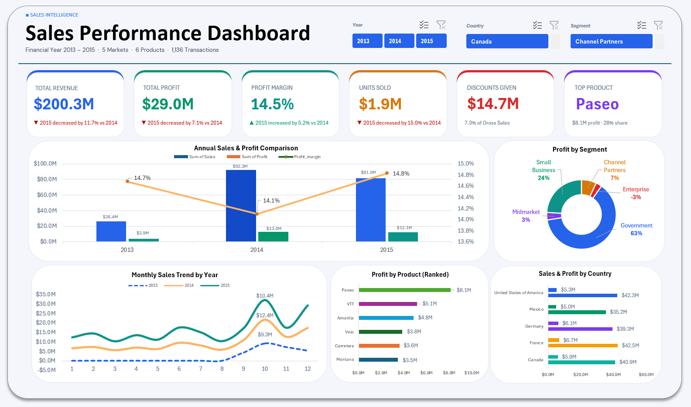

# Hi, I'm Sara Farouk 👋

### Aspiring Data Analyst

I transform raw data into interactive dashboards and actionable business insights.

Power BI • Excel • SQL • Python • Tableau

---

## 👩‍💻 About Me

* 🎓 Business Administration Graduate
* 📊 Passionate about Data Analytics & Business Intelligence
* 🌱 Currently learning SQL, Python, Statistics, and Advanced Power BI
* 🎯 Building real-world portfolio projects

---

## 🛠️ Tech Stack

**Analytics Tools**

* 📊 Power BI
* 📊 Tableau
* 📈 Microsoft Excel
* ⚡ DAX
* 🔄 Power Query

---

# 🚀 Featured Projects

<table>
<tr>

<td width="50%">

### 🚖 Uber Ride Analysis Dashboard

Interactive Power BI dashboard analyzing bookings, revenue, cancellations and customer ratings.

➡️ **[View Project](https://github.com/Siri1724/Uber-Ride-Analysis-Dashboard)**

</td>

<td>

</td>

</tr>

<tr>

<td>

### 📈 Sales Dashboard (Excel)

Interactive Excel dashboard for sales performance analysis.

➡️ **[View Project](https://github.com/Siri1724/Sales-Dashboard-Excel)**

</td>

<td>

</td>

</tr>

<tr>

<td>

</table>

---

## 📜 Certifications

* Excel – Analyst Builder
* Google Data Analytics Professional Certificate 

---

## 🌱 Currently Learning

* SQL
* Python
* Statistics

---

## 📫 Connect with Me

* LinkedIn https://www.linkedin.com/in/sara-farouk1/
* GitHub https://github.com/Siri1724
* Email sarafaroukk17@gmail.com
